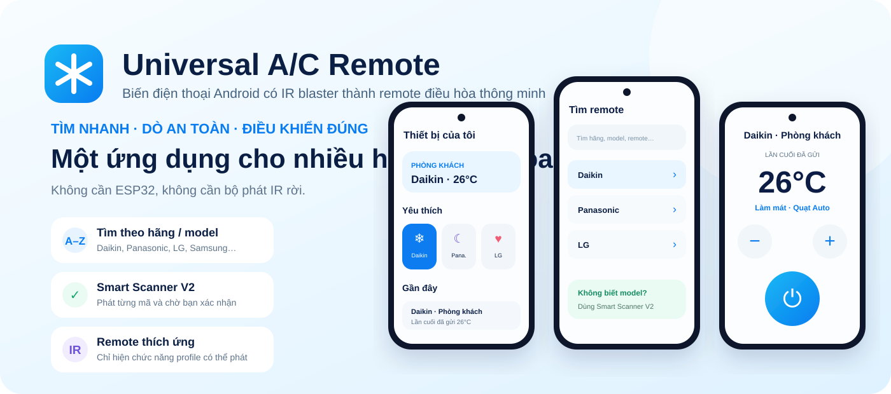
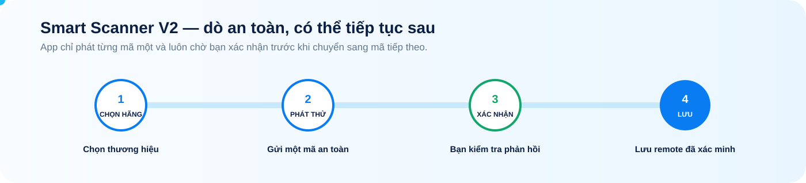
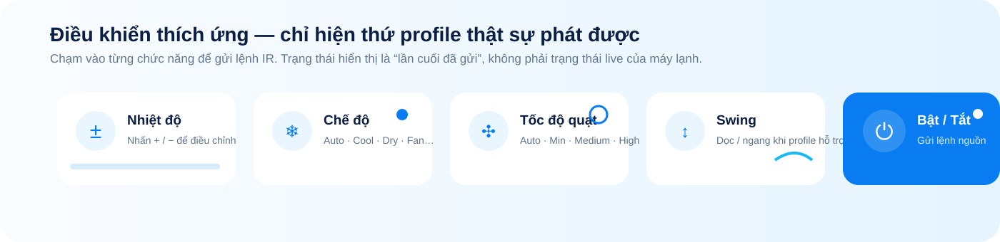
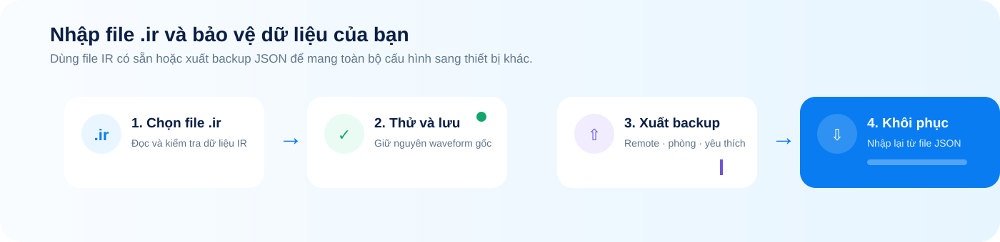

# Universal A/C Remote

<p align="center">
  
</p>

<p align="center">
  <strong>Biến điện thoại Android có IR blaster thành remote điều hòa đa năng, hiện đại và dễ dùng.</strong>
</p>

<p align="center">
  <a href="https://github.com/thanhnha01/universal-ac-remote/releases/latest"><strong>📥 Tải APK mới nhất</strong></a>
  · <a href="#-cách-sử-dụng">Cách sử dụng</a>
  · <a href="#-tính-năng-nổi-bật">Tính năng</a>
  · <a href="#-yêu-cầu-thiết-bị">Yêu cầu thiết bị</a>
  · <a href="#-kiến-trúc">Kiến trúc</a>
</p>

<p align="center">
  
  
  
  
  
</p>

---

## ❄️ Universal A/C Remote là gì?

Universal A/C Remote là ứng dụng Android điều khiển máy lạnh bằng **bộ phát hồng ngoại tích hợp trên điện thoại**.

Ứng dụng được xây dựng cho những tình huống rất thực tế: remote gốc bị mất, hỏng, khó tìm đúng model hoặc bạn muốn gom nhiều máy lạnh vào một giao diện thống nhất.

Điểm khác biệt của dự án:

- **Không cần ESP32**
- **Không cần hub Wi‑Fi**
- **Không cần thiết bị IR rời**
- Phát tín hiệu trực tiếp qua Android `ConsumerIrManager`
- Hỗ trợ tìm theo **hãng / model máy / model remote**
- Có **Smart Scanner V2** khi không biết model
- Remote hiển thị theo **khả năng thực tế của profile**
- Có nhập file `.ir`, backup/restore và cập nhật app

> Mục tiêu của app là biến chính chiếc điện thoại Android có IR blaster của bạn thành một remote điều hòa mạnh, gọn và đáng tin cậy.

---

## 📥 Tải ứng dụng

Bản APK ổn định mới nhất được phát hành tại GitHub Releases:

### 👉 [Tải Universal A/C Remote mới nhất](https://github.com/thanhnha01/universal-ac-remote/releases/latest)

Release có thể bao gồm:

- APK cài đặt
- `update.json`
- `SHA256SUMS.txt`
- metadata catalog
- thông tin nguồn dữ liệu IR được pin

> Android có thể yêu cầu cho phép cài ứng dụng từ nguồn hiện tại. Ứng dụng không sử dụng cơ chế cài đặt im lặng.

---

## ✨ Tính năng nổi bật

### 🔎 Tìm remote theo hãng và model

Bạn có thể tìm nhanh bằng:

- tên hãng
- model máy lạnh
- model remote
- danh sách hãng **A–Z**
- nhóm **Series / Model** khi catalog có đủ dữ liệu

Các hãng phổ biến được đưa lên trước để thao tác nhanh hơn.

### 🧠 Smart Scanner V2

Không biết chính xác model? Chọn hãng và để Smart Scanner hỗ trợ.

<p align="center">
  
</p>

Scanner được thiết kế theo hướng an toàn:

- chỉ phát **một mã mỗi lần**
- luôn chờ người dùng xác nhận
- không chạy brute-force tự động
- bước kiểm tra nguồn được giữ về cuối
- có thể thoát và **tiếp tục phiên dò** sau
- profile từng xác minh thành công trên máy sẽ được ưu tiên

### 🎛️ Adaptive Remote — remote thích ứng

Remote không cố hiển thị mọi nút có thể tưởng tượng ra. Nó chỉ hiển thị các điều khiển mà profile hiện tại thực sự hỗ trợ và encoder có thể phát.

<p align="center">
  
</p>

Tùy profile, bạn có thể có:

- Bật / Tắt
- Nhiệt độ
- Chế độ
- Tốc độ quạt
- Swing dọc
- Swing ngang

> **Lưu ý quan trọng:** IR là giao tiếp một chiều. Ứng dụng hiển thị **“lần cuối đã gửi”**, không giả vờ biết trạng thái thực tế hiện tại của máy lạnh.

### 🏠 Phòng, yêu thích và thiết bị gần đây

Bạn có thể tổ chức remote theo:

- Phòng
- Yêu thích
- Thiết bị dùng gần đây
- Tên tùy chỉnh

Nhờ vậy các remote thường dùng luôn ở ngay trang đầu.

### 📄 Nhập file `.ir`

Ứng dụng hỗ trợ nhập file raw IR kiểu Flipper từ bộ nhớ Android.

Smart Import sẽ:

- kiểm tra file trước khi dùng
- giữ nguyên waveform IR gốc
- nhận diện nhóm lệnh phổ biến
- chuẩn hóa nhãn như Power, Temp ±, Fan, Swing, Timer, Light
- cho phép phát thử trước khi lưu

Ứng dụng **không tự bịa thêm lệnh** và không chỉnh timing IR trong file gốc.

### ☁️ Backup / Restore

<p align="center">
  
</p>

Backup JSON có thể lưu:

- remote đã lưu
- lệnh IR import
- phòng
- yêu thích
- kết quả xác minh
- lịch sử dùng gần đây
- trạng thái lần cuối đã gửi

Restore được kiểm tra schema trước khi thay thế dữ liệu local.

### 🩺 Chẩn đoán phần cứng IR

Màn hình Diagnostics phân biệt rõ:

- **Ready** — Android xác nhận có IR emitter hoạt động
- **Limited** — có dấu hiệu hỗ trợ IR nhưng chưa xác nhận emitter
- **Unavailable** — Android không cung cấp Consumer IR service

Nếu thiết bị trả về dải carrier frequency, app sẽ hiển thị trực tiếp theo kHz.

### 🔄 Cập nhật ứng dụng

Ứng dụng có thể kiểm tra bản stable từ GitHub Releases và xác minh:

- URL HTTPS hợp lệ
- manifest update
- SHA-256 của APK
- khả năng mở package installer trên Android

Nền database updater cũng đã có:

- compatibility gate
- SHA-256
- hook xác minh chữ ký
- cài atomic
- rollback

---

## 📱 Cách sử dụng

### Cách 1 — Bạn biết hãng hoặc model

1. Mở **Thêm máy lạnh**
2. Tìm hãng hoặc model
3. Chọn hãng trong danh sách A–Z
4. Chọn Series / Model phù hợp
5. Thử profile và xác minh
6. Lưu remote

### Cách 2 — Bạn không biết model

1. Chọn hãng
2. Mở **Smart Scanner V2**
3. Nhấn phát thử
4. Quan sát máy lạnh
5. Chọn **Có phản hồi** hoặc **Không phản hồi**
6. Khi tìm được mã đúng, lưu remote

### Cách 3 — Bạn đã có file `.ir`

1. Vào **Nhập file .ir**
2. Chọn file trên điện thoại
3. Kiểm tra danh sách lệnh
4. Phát thử
5. Đặt tên remote
6. Lưu

---

## ⚙️ Cách ứng dụng hoạt động

```text
Jetpack Compose UI
        ↓
Thiết bị đã lưu / Scanner / Remote state
        ↓
AcState
        ↓
Protocol encoder hoặc profile/raw IR đã validate
        ↓
IrTransmission
        ↓
Android ConsumerIrManager
        ↓
IR blaster tích hợp trên điện thoại
```

Với remote protocol-based, app dùng native bridge cho phần A/C phù hợp từ IRremoteESP8266.

Với profile/raw IR, dữ liệu được resolve và validate trước khi phát.

---

## 🗃️ Nguồn dữ liệu IR

Unified catalog hiện tổng hợp dữ liệu từ:

- **IRremoteESP8266**
- **SmartIR**
- **Flipper IRDB** — chỉ dữ liệu A/C
- **irplus**

Nguồn upstream được pin và theo dõi để build có thể tái tạo, thay vì kéo “latest” không kiểm soát vào mỗi lần build.

Xem thêm:

- [Nguồn upstream](docs/UPSTREAM_SOURCES.md)
- [Protocol catalog](docs/PROTOCOL_CATALOG.md)
- [Mô hình IR protocol](docs/IR_PROTOCOL.md)

---

## 📲 Yêu cầu thiết bị

### Bắt buộc

- Android **6.0 / API 23** trở lên
- kiến trúc **arm64-v8a**
- điện thoại có **IR blaster tích hợp**
- Android phải expose phần cứng qua `ConsumerIrManager`

### Thiết bị mục tiêu chính

Thiết bị mục tiêu ban đầu của dự án là **OnePlus 15**.

Ứng dụng cũng có thể chạy trên các máy Android khác nếu hệ thống expose bộ phát IR tương thích qua Consumer IR API.

> Việc điện thoại trông như có “mắt IR” chưa đủ. Android phải cung cấp emitter qua API mà ứng dụng sử dụng.

---

## 🛠️ Build từ source

### Toolchain

- JDK 17
- Android SDK 35
- Android NDK 27.2.12479018
- CMake 3.22.1
- Kotlin + Jetpack Compose
- Room
- Native C++ IR bridge

### Build debug

```bash
./gradlew :app:assembleDebug
```

### Chạy unit test

```bash
./gradlew :app:testDebugUnitTest
```

### Chạy lint

```bash
./gradlew :app:lintDebug
```

### Kiểm tra đầy đủ

```bash
./gradlew :app:testDebugUnitTest :app:lintDebug :app:assembleDebug
```

Release signing được cấu hình bằng biến môi trường trong CI và không được commit vào repository.

---

## 🧱 Kiến trúc

```text
app/src/main/java/com/thanhnha/universalacremote/
├── ProductionScreens.kt
├── RemoteControlScreen.kt
├── SavedRemoteStore.kt
├── ScannerSessionStore.kt
├── BackupCodec.kt
├── BackupPanel.kt
├── ImportedCommandPresentation.kt
├── ir/
│   ├── AcState.kt
│   ├── AndroidIrTransmitter.kt
│   ├── CatalogTransmitter.kt
│   ├── NativeAcEncoder.kt
│   ├── ProtocolRegistry.kt
│   ├── RemoteCapabilities.kt
│   ├── RemoteResolver.kt
│   └── UniversalAcScanner.kt
└── update/
    ├── AppUpdate.kt
    ├── DatabaseUpdate.kt
    └── UpdateScreen.kt
```

Tài liệu chi tiết:

- [Kiến trúc hệ thống](docs/ARCHITECTURE.md)
- [Mục tiêu sản phẩm](docs/PRODUCT.md)
- [Chiến lược kiểm thử](docs/TESTING.md)
- [CI/CD](docs/CI_CD.md)
- [Hệ thống cập nhật](docs/UPDATE_SYSTEM.md)
- [UI / UX](docs/UI_UX.md)
- [Roadmap](docs/ROADMAP.md)

---

## 🧭 Nguyên tắc sản phẩm

### Không giả trạng thái máy lạnh

IR là một chiều. App chỉ lưu trạng thái **lần cuối đã gửi**.

### Không hiển thị nút chết

Chỉ hiển thị control khi encoder/profile thực sự có thể phát lệnh hợp lệ.

### Không brute-force IR

Scanner luôn chờ người dùng xác nhận giữa các mã.

### Dữ liệu phải tái tạo được

Nguồn IR, build input và release artifact đều được pin và có thể audit.

---

## 🚧 Trạng thái dự án

Bản V3 đã được merge vào `main` với:

- Design system + navigation V3
- Home / Rooms / Favorites / Recent
- Brand Browser A–Z
- Brand → Series / Model
- Smart Scanner V2 có resume
- Adaptive Remote
- AcState V2 foundation
- Smart Import `.ir`
- Backup / Restore
- App updater
- Database updater security foundation
- IR diagnostics
- regression audit các luồng chính

Ưu tiên tiếp theo là kiểm thử thực tế trên nhiều máy lạnh và đặc biệt là **OnePlus 15**.

---

## 🤝 Đóng góp

Trước khi thay đổi repository, hãy đọc [AGENTS.md](AGENTS.md).

Một pull request tốt nên:

- giải quyết một vấn đề rõ ràng
- tránh refactor ngoài phạm vi
- có test cho thay đổi hành vi
- giữ nguyên nguyên tắc scanner an toàn
- không thêm claim IR chưa được kiểm chứng
- giữ attribution nguồn dữ liệu rõ ràng

---

## 🔐 Bảo mật và độ tin cậy

Luồng update và dữ liệu IR được xem là phần nhạy cảm.

APK update bị giới hạn vào nguồn GitHub HTTPS được cho phép và phải qua kiểm tra checksum.

Database updater foundation hỗ trợ xác minh chữ ký, compatibility gate, atomic install và rollback.

Không commit secret, signing key hoặc dữ liệu IR không rõ nguồn gốc.

---

## ❤️ Cảm ơn

Dự án được hưởng lợi rất nhiều từ cộng đồng mã nguồn mở IR, đặc biệt:

- IRremoteESP8266
- SmartIR
- Flipper IRDB
- irplus

---

<p align="center">
  <strong>Một điện thoại · Nhiều máy lạnh · Một trải nghiệm điều khiển thống nhất.</strong>
</p>

<p align="center">
  <a href="https://github.com/thanhnha01/universal-ac-remote/releases/latest"><strong>📥 Tải APK mới nhất →</strong></a>
</p>
